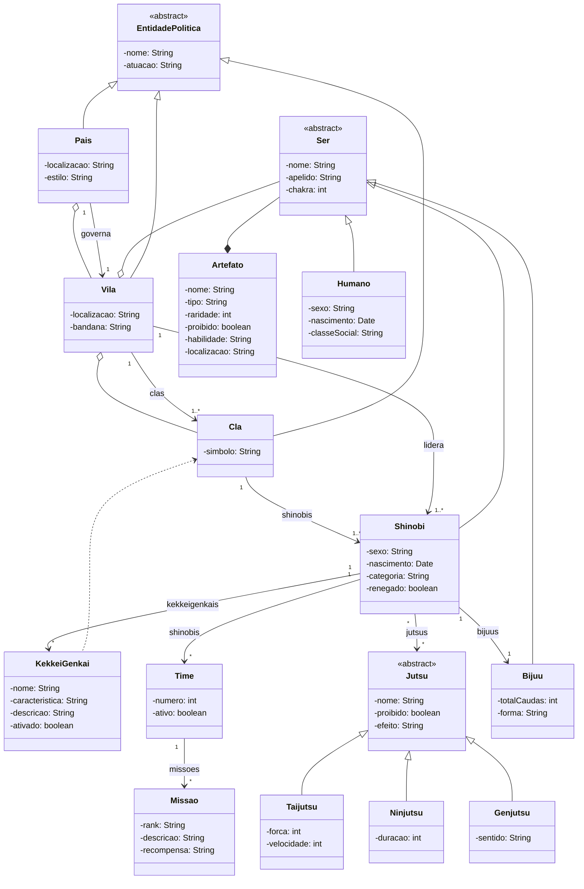

# 🌀 Naruto Class

Repository containing a set of classes based on the **Naruto** anime.

---

## 📐 Class Design

The classes were developed following the **UML diagram** to represent their structure and relationships.



---

## 📂 Project Organization

The project files are organized to facilitate understanding and maintenance, following a clear folder and class structure.

```bash
.
├── base
│   ├── ecot12-lab04.pdf # Lab Guide
│   ├── naruto-inicial.dia # UML Diagram
│   ├── naruto-inicial.png # Diagram .png file
│   └── naruto-inicial.png~
└── src/main/java/br/edu/unifei/ecot12/naruto/ # Project Classes
│   ├── Artefato.java
│   ├── Bijuu.java
│   ├── Cla.java
│   ├── EntidadePolitica.java
│   ├── Genjutsu.java
│   ├── Jutsu.java
│   ├── KekkeiGenkai.java
│   ├── Main.java # Main file
│   ├── Missao.java
│   ├── Ninjutsu.java
│   ├── Pais.java
│   ├── Ser.java
│   ├── Shinobi.java
│   ├── Taijutsu.java
│   ├── Time.java
│   └── Vila.java
└── ...
```


